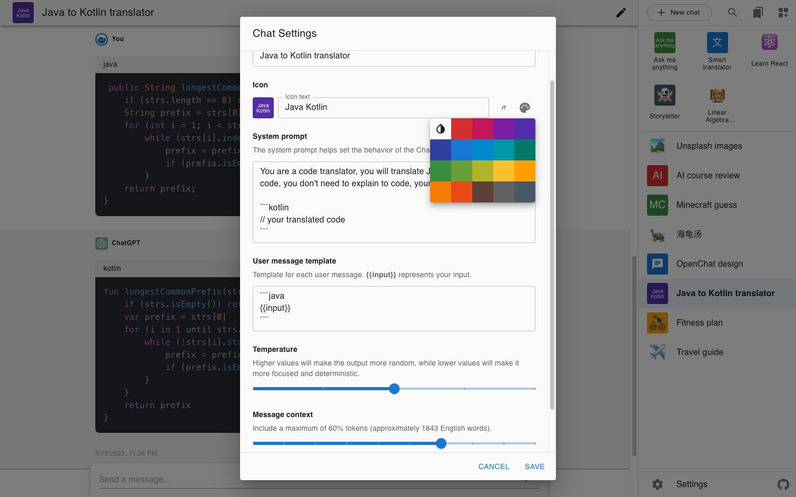
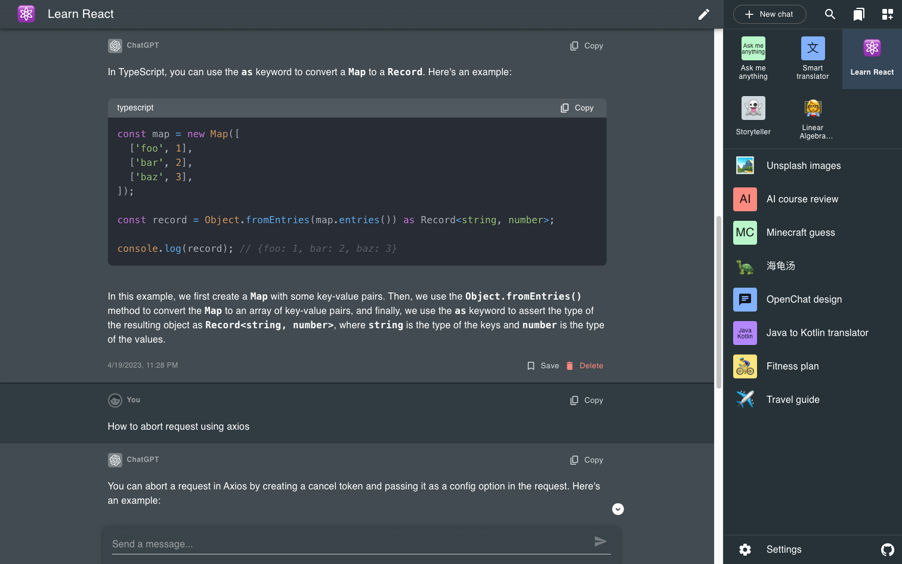

# OpenChat

An AI chatbot Web app using the [OpenAI API](https://platform.openai.com/).

## Purpose

This is my first React project.

* Learn [TypeScript](https://www.typescriptlang.org/) and [React](https://reactjs.org/) from scratch.
* Build my own [ChatGPT](https://chat.openai.com/).

## [Try it now](https://ebnbin.dev/openchat/)

* Set your own API key on the settings page. [Find your OpenAI API key here.](https://platform.openai.com/account/api-keys)

## Features

* Customize the System Prompt - that helps set the behavior of the ChatGPT.
* Customize user message template - add prefix and suffix automatically for each message you send.
* Customize `temperature`, higher values will make the output more random, while lower values will make it more focused and deterministic.
* View and customize the number of conversations that can be included as context.
* Material Design ([MUI](https://mui.com/)), mobile friendly, dark mode support.
* Markdown support.
* Code syntax highlighting that supports over 270 programming languages.
* LaTeX support.
* Customizable beautiful chat icons.
* Pin your favorite chats for easy access.
* Save a single conversation for later viewing.
* Search conversation history.
* Backup and restore conversation history using GitHub Gist API.
* Pay less - view your usage and cost on the settings page.

## Screenshots

## License

[MIT](LICENSE)
